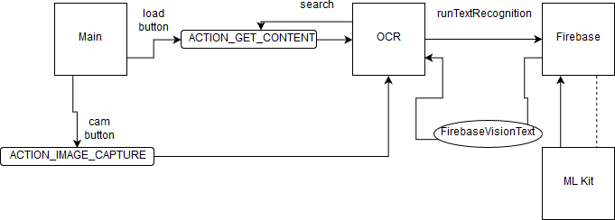

# OLINKR-final

# ***OLINKR***

Die *Main-Activity* kann einen *MediaStore.ACTION_IMAGE_CAPTURE*-Intent aufrufen,
dessen foto in *onActivityResult* an die OCR-Activity gegeben wird.
Oder die OCR-Activity wird dirket geöffnet.

Die *OCR-Activity* kann durch *Intent.ACTION_GET_CONTNET* das Smartphone nach einem Bild durchsuchen.
In *onActivityResult* wird das Bilds an *runTextRecognition* gegeben.

Hier wird das Bild als *FirebaseVisionImage* einem *FirebaseVisionTextDetector* übergeben.
Der erkannte Text wird einem View *Textblock* übergeben. Dieser zeigt sich dann in einem *scrollview* an und
ist durch den *searchview* durchsuchbar. 

Ursprünglich wollte ich nur eine Funktionalität mit Links/URLS bereitstellen, da aber der Android-interne TextClassifier
erst mit API 8 verfügbar ist kam ich auf die Idee eine generelle Bild-zu-Text App zu machen. Der Name der App sollte auf Optical Character Recognition anspielen, mit Optical Link Recognition. Jetzt stelle ich mir vor das Link im Namen steht für die verbesserte Verbundenheit zwischen analog/digital oder Desktop/Smartphone.

Ich wollte auch erst mehrere Textblöcke anzeigen, bis mir der Nutzen dessen nicht mehr klar war. Daher die unbenutzte Funktion *collapse* und all der layout-code in der Klasse statt eines xml-files.

Aus einem Grund den ich noch nicht finden konnte, funktioniert die Texterkennung deutlich besser wenn das Bild nicht mit der App sondern mit der Standart-Kamera geschossen wird.
